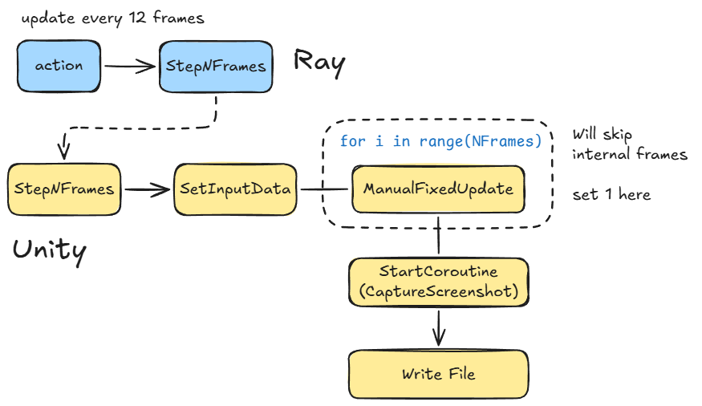

# Footsies Data Collection Pipeline

A tool for collecting training data from the Footsies fighting game.



## Training

Run `rllib/tuned_examples/ppo/multi_agent_footsies_ppo.py` to train agents. The script will **auto-download** the game binary to `--binary-download-dir`.

**Note**: Use `linux_windowed` build to capture frames. Images are captured directly through Unity.

## Quick Start

```bash
# Run once
./run.sh

# Run multiple times
./run_n.sh 10
```

You can also adjust `num_games` in `record_footsies.py` to control the number of games per run.

## Modifying Unity Code

The game has been modified to support data collection. Source code is in `footsies_unity_code/`.

To modify and rebuild:

1. Open `footsies_binaries_windowed/footsies_Data/Managed/Assembly-CSharp.dll` with [dnSpy](https://github.com/dnSpy/dnSpy)
2. Apply changes from `footsies_unity_code/`
3. Save and recompile


