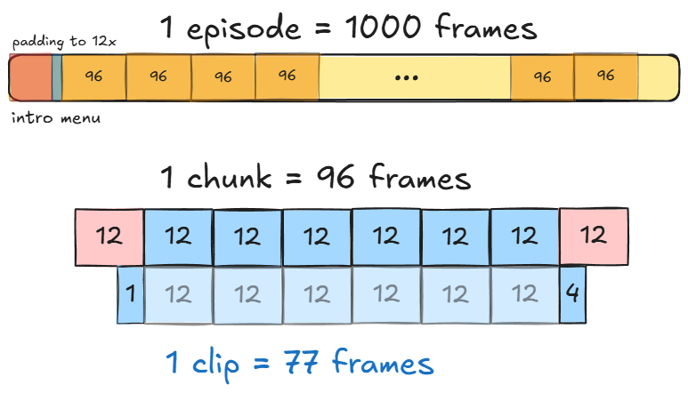

# Footsies Data Collection Pipeline

A tool for collecting training data from the Footsies fighting game.


## Training

Run `rllib/tuned_examples/ppo/multi_agent_footsies_ppo.py` to train agents. The script will **auto-download** the game binary to `--binary-download-dir`.

**Note**: Use `linux_windowed` build to capture frames. Images are captured directly through Unity.

## Quick Start

```bash
# Run once
./run.sh

# Run multiple times
./run_n.sh 10
```

You can also adjust `num_games` in `record_footsies.py` to control the number of games per run.

## Modifying Unity Code

The game has been modified to support data collection. Source code is in `footsies_unity_code/`.

To modify and rebuild:

1. Open `footsies_binaries_windowed/footsies_Data/Managed/Assembly-CSharp.dll` with [dnSpy](https://github.com/dnSpy/dnSpy)
2. Apply changes from `footsies_unity_code/`
3. Save and recompile


## Details

The Footsies environment limits the maximum frame count per episode. We use frame_skip to control the frame-step mapping; if frame_skip is greater than 1, Unity skips rendering intermediate frames but maintains physics simulation.

The script also includes a MODEL_FRAME_SKIP parameter, which controls how many frames an input is repeated. I set this to `12` to match the block configuration in MatrixGame.

For data collection, I export images directly from Unity first. The format of image name is `episode{N}_{frame:06d}_{p1_action}_{p2_action}_{p1_valid}_{p2_valid}.png`, with `p1_action` is our target label. To ensure compatibility with FastVideo training, convert these images into video clips (96 frames each) and action.npy files. This length was chosen to maintain action consistency while allowing sufficient buffer for training. FPS is 25 to match with MatrixGame.


